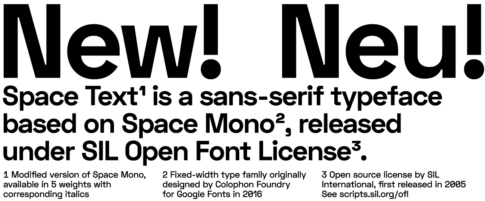

# Space Text

Space Text is a modified version of Space Mono (fixed-width typeface family designed by Colophon Foundry for Google Fonts).

Available in 5 weights and ~~corresponding italics~~ (later this year).

Download the latest release of Space Text font family [here](../../releases/latest).

## Language Support

Latin Extended-A (Afrikaans, Basque, Breton, Catalan, Croatian, Czech, Danish, Dutch, English, Estonian, Finnish, French, Gaelic, German, Hungarian, Icelandic, Indonesian, Irish, Italian, Latvian, Lithuanian, Norwegian, Polish, Portuguese, Romanian, Saami, Serbian, Slovak, Slovenian, Spanish, Swahili, Swedish, Turkish)

## License

Space Text is available under the SIL Open Font License v1.1

See [OFL.txt](OFL.txt) for more details.