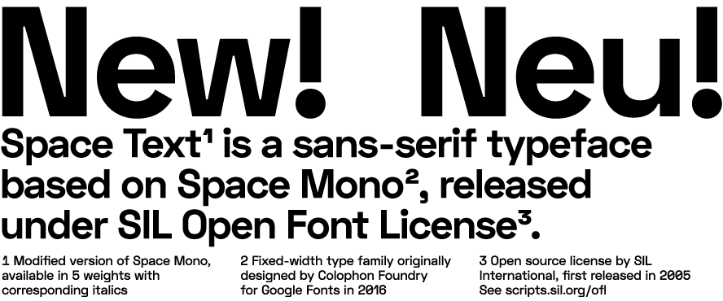
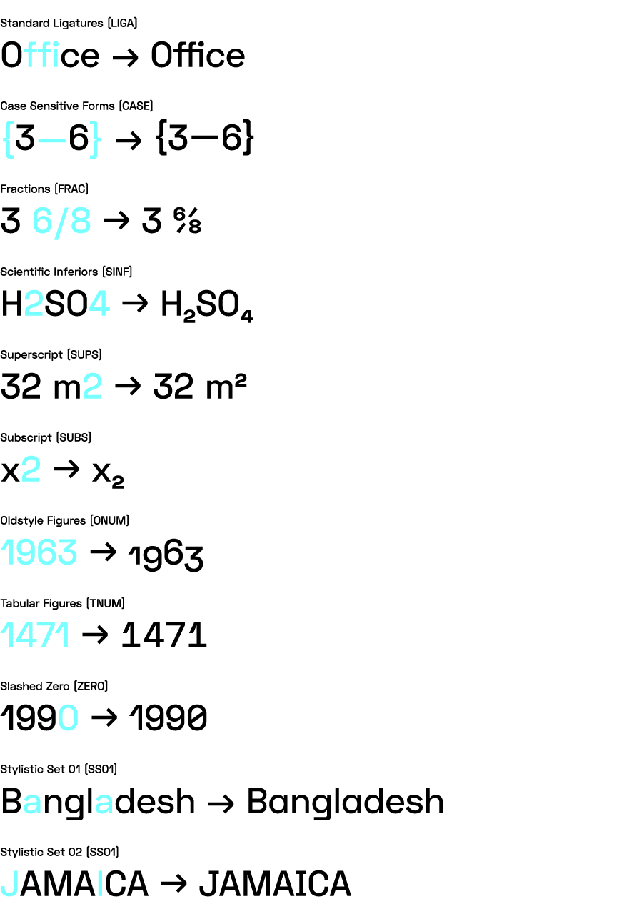
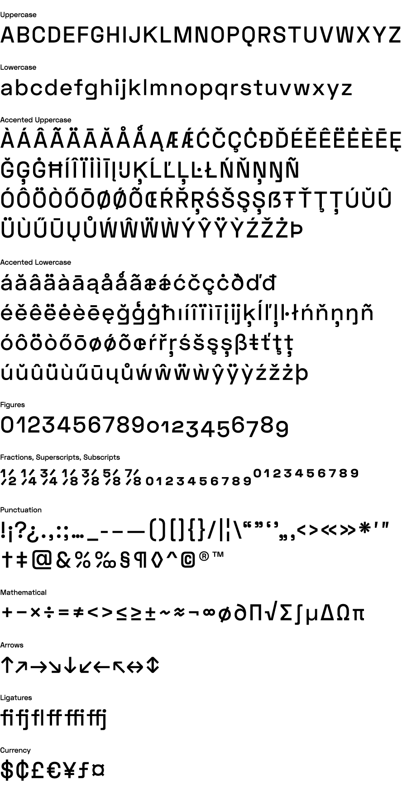

# Space Text

Space Text is a modified version of Space Mono (fixed-width typeface family designed by Colophon Foundry for Google Fonts). Space Text is available in 5 weights and ~~corresponding italics~~ (later this year).

**[Download latest release](../../releases/latest)**

## OpenType Features

Standard Ligatures, Case Sensitive Forms, Fractions, Numerators, Denominators, Scientific Inferiors, Superscript, Subscript, Oldstyle Figures, Lining Figures, Proportional Figures, Tabular Figures, Slashed Zero, Stylistic Sets

## Language Support & Character Set

Latin Extended-A (Afrikaans, Basque, Breton, Catalan, Croatian, Czech, Danish, Dutch, English, Estonian, Finnish, French, Gaelic, German, Hungarian, Icelandic, Indonesian, Irish, Italian, Latvian, Lithuanian, Norwegian, Polish, Portuguese, Romanian, Saami, Serbian, Slovak, Slovenian, Spanish, Swahili, Swedish, Turkish)

## License

Space Text is available under the SIL Open Font License v1.1

See [OFL.txt](OFL.txt) for more details.

## About Author

Florian Karsten is a graphic designer & developer highly interested in art & culture, open-source and cryptocurrency world.

Questions, comments, requests, suggestions: mail@floriankarsten.com